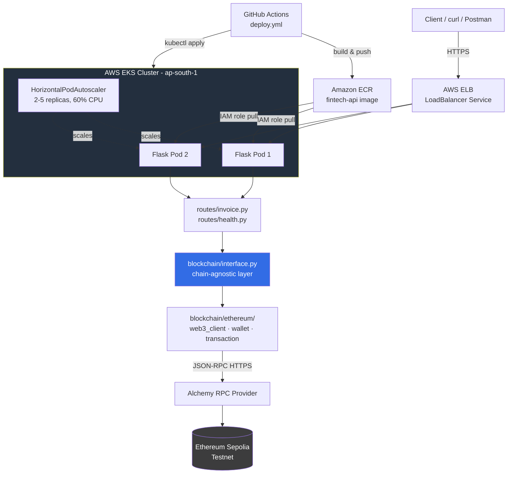

# 🏦 FINTECH-CLOUD-EKS — Containerised Fintech API on AWS Kubernetes with Blockchain Settlement

> End-to-end DevOps + Web3 project: Python Flask fintech API with real **Ethereum Sepolia testnet** payment settlement, containerised with Docker, infrastructure provisioned via **eksctl** and **Terraform**, pushed to Amazon ECR, deployed to AWS EKS, tested on Minikube, and automated via GitHub Actions CI/CD.

[](#)
[](#)
[](#)
[](#)
[](#)
[](#)
[](#)

---

## 📋 Table of Contents

- [Project Overview](#project-overview)
- [Architecture](#-architecture)
- [Why Fintech?](#-why-fintech)
- [Tech Stack](#tech-stack)
- [Repository Structure](#repository-structure)
- [API Reference](#-api-reference)
- [Phase 1 — System Setup & AWS CLI](#phase-1--system-setup--aws-cli)
- [Phase 2 — Application & Docker](#phase-2--application--docker)
- [Phase 3 — Amazon ECR](#phase-3--amazon-ecr)
- [Phase 4 — EKS via eksctl](#phase-4--eks-via-eksctl)
- [Phase 5 — EKS via Terraform](#phase-5--eks-via-terraform)
- [Phase 6 — Kubernetes Deployment](#phase-6--kubernetes-deployment)
- [Phase 7 — GitHub Actions CI/CD](#phase-7--github-actions-cicd)
- [Phase 8 — Minikube Local Testing](#phase-8--minikube-local-testing)
- [Phase 9 — Blockchain Settlement Layer (Ethereum Sepolia)](#phase-9--blockchain-settlement-layer-ethereum-sepolia)
- [Reliability & Production Hardening](#-reliability--production-hardening)
- [Monitoring Strategy](#-monitoring-strategy)
- [Testing Strategy](#-testing-strategy)
- [Performance Metrics & Cost Analysis](#-performance-metrics--cost-analysis)
- [Security Considerations](#-security-considerations)
- [Scalability & Reliability Design](#-scalability--reliability-design)
- [Troubleshooting Runbook](#-troubleshooting-runbook)
- [Real Errors & Fixes](#real-errors--fixes)
- [Live Proof](#live-proof)
- [Versions](#versions)
- [Roadmap](#-roadmap)
- ## AI InfraOps Agent

This repository also includes an **AI-powered Kubernetes InfraOps agent** designed to investigate infrastructure incidents, collect operational evidence, identify likely root causes, and recommend remediation.The agent operates as a controlled investigation layer over Kubernetes rather than blindly executing AI-generated shell commands.

### Architecture

```text
                    User / Engineer
                          │
                          ▼
                 AI InfraOps Agent
                          │
                    Investigation
                          │
          ┌───────────────┼────────────────┐
          ▼               ▼                ▼
     Kubernetes        Pod Logs          Events
       API              │                 │
          └─────────────┼─────────────────┘
                        ▼
                  Evidence Set
                        │
                        ▼
                   AI Reasoning
                        │
                        ▼
                 Root Cause Analysis
                        │
                        ▼
              Remediation Recommendation
                        │
                        ▼
                 Human Approval
                        │
                        ▼
             Controlled Remediation
                        │
                        ▼
                  Verification
```

### What the agent does

The current implementation is **read-only** and focuses on incident investigation.

It can:

* Inspect Kubernetes pod status
* Identify restart counts and container failure reasons
* Retrieve pod logs
* Inspect pod configuration and events
* Correlate Kubernetes evidence
* Send the collected evidence to an LLM for analysis
* Produce a root-cause assessment
* Recommend remediation steps

The current design intentionally separates **investigation** from **remediation**. The agent does not execute arbitrary commands generated by the LLM.

### Example: Investigating a `CrashLoopBackOff`

A deliberately unhealthy Kubernetes deployment was created locally with an extremely low memory limit:

```yaml
resources:
  limits:
    memory: "10Mi"
```

The container repeatedly terminated and Kubernetes reported:

```text
CrashLoopBackOff
```

The agent was then invoked with:

```bash
python agent.py "Why is fintech-api unhealthy?"
```

The investigation collected evidence including:

```text
Pod status: Running
Container restarts: 14
Termination reason: OOMKilled
Exit code: 137
Event: BackOff
Application logs: unavailable because the process terminated before producing logs
```

The agent correlated these signals and identified the likely root cause:

```text
Root Cause:
The container exceeds its configured 10Mi memory limit.
Kubernetes terminates the process with OOMKilled (exit code 137),
after which the container is repeatedly restarted, resulting in
CrashLoopBackOff.
```

The agent then produced remediation recommendations such as:

* Increase the container memory limit
* Review memory requests and limits
* Investigate potential memory leaks
* Redeploy and verify pod stability
* Monitor memory usage after remediation

### Why this is different from a chatbot

The agent is designed around **infrastructure evidence collection**, not generic question answering.

Instead of:

```text
User → LLM → Answer
```

the workflow is:

```text
User
  ↓
Incident question
  ↓
Infrastructure tools
  ↓
Kubernetes evidence
  ↓
Logs + events + status
  ↓
LLM reasoning
  ↓
Root-cause analysis
  ↓
Remediation recommendation
```

This makes the AI component useful as an **InfraOps investigation layer** over an existing Kubernetes environment.

### Safety Model

The current agent operates in **read-only mode**.

Future remediation capabilities will use an explicit control boundary:

```text
AI recommendation
       ↓
Human approval
       ↓
Allowlisted remediation function
       ↓
Parameter validation
       ↓
Kubernetes API
       ↓
Post-remediation verification
```

The design avoids allowing the LLM to directly execute arbitrary shell commands against the cluster.

### Current Capabilities

| Capability                       | Status        |
| -------------------------------- | ------------- |
| Kubernetes pod discovery         | ✅ Implemented |
| Pod status analysis              | ✅ Implemented |
| Container restart detection      | ✅ Implemented |
| Pod logs                         | ✅ Implemented |
| Kubernetes events                | ✅ Implemented |
| Pod description/investigation    | ✅ Implemented |
| LLM-based root-cause analysis    | ✅ Implemented |
| Read-only incident investigation | ✅ Implemented |
| Automated remediation            | 🔄 Planned    |
| Human approval workflow          | 🔄 Planned    |
| Post-remediation verification    | 🔄 Planned    |
| Prometheus-based investigation   | 🔄 Planned    |
| Multi-incident workflow routing  | 🔄 Planned    |

### Planned Incident Scenarios

The agent will be expanded to investigate multiple common Kubernetes failure modes:

```text
CrashLoopBackOff
        │
        ├── OOMKilled
        ├── application crash
        └── configuration failure

ImagePullBackOff
        │
        ├── incorrect image/tag
        ├── registry authentication
        └── unavailable image

Readiness/Liveness Failure
        │
        ├── incorrect probe configuration
        ├── application unavailable
        └── startup timing problem
```

The longer-term goal is to combine Kubernetes state, logs, events and Prometheus metrics into a single **AI-assisted incident investigation workflow**.

### Technologies

* Python
* Kubernetes Python Client
* Kubernetes API
* Docker
* Minikube
* LLM inference via Groq
* Flask application infrastructure
* Prometheus/Grafana integration planned

### Project Significance

The AI InfraOps layer extends this project beyond traditional deployment automation.

The resulting platform demonstrates three connected engineering layers:

```text
┌──────────────────────────────────────────┐
│          Business Application            │
│       Flask Fintech API + Web3           │
├──────────────────────────────────────────┤
│       Infrastructure & Platform          │
│    Docker + Kubernetes + AWS EKS         │
│       Terraform + CI/CD + HPA            │
├──────────────────────────────────────────┤
│           AI InfraOps Layer              │
│ Incident Investigation + AI Reasoning    │
│ Evidence Collection + Remediation        │
└──────────────────────────────────────────┘
```

This provides a foundation for evolving the project from a conventional DevOps deployment into an **AI-assisted infrastructure operations platform**.

---

## Project Overview

| Detail            | Value                                                        |
| ------------------ | ------------------------------------------------------------ |
| AWS Account        | `[SANITISED]`                                                |
| Region              | `ap-south-1` (Mumbai)                                        |
| OS                  | Ubuntu 24.04.4 LTS — WSL2 kernel `6.6.87.2`                  |
| IAM User            | `dd-user`                                                    |
| ECR Repo            | `[ACCOUNT-ID].dkr.ecr.ap-south-1.amazonaws.com/fintech-api`  |
| GitHub Repo         | `rey26341-sudo/FINTECH-CLOUD-EKS`                            |
| Clusters            | `reluna-cluster` (eksctl) · `fintech-eks` (Terraform)        |
| Blockchain Network  | Ethereum **Sepolia** testnet (chain ID `11155111`)           |
| Web3 Provider       | Alchemy RPC (HTTPS endpoint)                                 |

**Two complete infrastructure paths proven:**

- **eksctl path** → `reluna-cluster` — Kubernetes 1.34
- **Terraform path** → `fintech-eks` — Kubernetes 1.29, 19 resources created

**Beyond infrastructure**, the API now performs real on-chain settlement: `POST /invoice` signs and broadcasts an actual transaction to Ethereum Sepolia and returns the transaction hash, verifiable on Etherscan.

---

## 🏗 Architecture



**Request flow for `POST /invoice`:**
1. Client sends a JSON payload (`to_address`, `amount`, optional `chain`) to the load-balanced Flask service
2. `routes/invoice.py` validates input and calls `blockchain/interface.py`
3. `interface.py` routes the call to the correct chain module — currently `blockchain/ethereum/`
4. `transaction.py` builds, signs (locally, using the wallet's private key), and broadcasts the transaction via the Alchemy RPC endpoint
5. Sepolia confirms the transaction; the API returns `{"status": "sent", "tx_hash": "0x..."}`
6. The transaction is independently verifiable on `sepolia.etherscan.io`

---

## 💡 Why Fintech?

Fintech systems have uniquely demanding requirements that make them the perfect proving ground for DevOps and Web3 practices:

- **High availability** — downtime means financial loss; even seconds of outage affects transactions
- **Secure infrastructure** — financial data requires IAM-based access, encrypted storage, and zero hardcoded credentials
- **Traffic spikes** — payment systems and trading platforms experience sudden surges requiring autoscaling
- **Auditability** — every deployment and every on-chain transaction is traceable — via CI/CD logs *and* a public blockchain explorer
- **Monitoring** — pod health, API latency, and error rates must be tracked continuously
- **Multi-chain readiness** — real fintech platforms can't assume a single blockchain; the settlement layer is built chain-agnostic from day one

---

## Tech Stack

| Tool                        | Version Proven      | Why It Was Used                                                                                                             |
| --------------------------- | -------------------- | ------------------------------------------------------------------------------------------------------------------------- |
| **Ubuntu 24.04 LTS (WSL2)** | kernel 6.6.87.2      | Linux environment on Windows — native Docker networking and kubectl compatibility                                          |
| **Python + Flask**          | 3.11 / Flask 3.1.3   | Lightweight API — minimal boilerplate, easy to containerise                                                                 |
| **web3.py**                 | 7.16.0                | Python library for signing and broadcasting Ethereum transactions to Sepolia via JSON-RPC                                  |
| **eth-account**             | 0.13.7                | Wallet/key management — loads a private key and signs raw transactions locally before broadcast                            |
| **python-dotenv**           | 1.2.2                 | Loads RPC URLs and private keys from `.env` — keeps secrets out of source code                                             |
| **Alchemy**                  | —                    | Ethereum Sepolia RPC provider — HTTPS JSON-RPC endpoint for reading chain state and broadcasting signed transactions        |
| **Docker**                   | 29.2.1                | Packages app and all dependencies into one portable image — the single unit of deployment                                  |
| **Amazon ECR**               | —                    | AWS-native private registry — EKS nodes pull images over internal network via IAM roles; no Docker credentials in pod specs |
| **AWS CLI**                  | v2.34.11              | Primary AWS interface — credentials, ECR repos, kubeconfig, VPC/subnet inspection                                          |
| **eksctl**                   | 0.224.0               | One command provisions full EKS cluster — VPC, subnets, IAM roles, CloudFormation, addons                                  |
| **Terraform**                | via snap              | IaC — reproducible cluster using `terraform-aws-eks` module; 19 resources in one `apply`                                   |
| **kubectl**                  | v1.35.2               | Standard Kubernetes CLI — applies manifests, inspects pods/services/nodes                                                   |
| **Minikube**                 | v1.38.1               | Local Kubernetes on Docker driver — free, fast manifest validation before cloud                                            |
| **GitHub Actions**           | ci.yml + deploy.yml   | Cloud CI/CD — every `git push` triggers build → push → deploy                                                              |

---

## Repository Structure

```
FINTECH-CLOUD-EKS/
├── .github/
│   └── workflows/
│       ├── deploy.yml          # CD: Configure AWS → Login ECR → Build → Push → kubectl apply
│       └── ci.yml              # CI: Login Docker Hub → Build → Push to Docker Hub
├── api-service/
│   ├── k8s/
│   │   ├── deployment.yaml     # 2 replicas, resource limits, liveness + readiness probes
│   │   ├── service.yaml        # NodePort (Minikube) / LoadBalancer (EKS)
│   │   └── hpa.yaml            # HorizontalPodAutoscaler — min 2, max 5, 60% CPU
│   ├── tests/
│   │   └── test_app.py         # Flask unit tests
│   ├── app.py                  # Flask app entrypoint — registers blueprints, health check
│   ├── config.py               # Loads Sepolia RPC URL / wallet key / chain ID from .env
│   ├── requirements.txt        # flask, web3, python-dotenv
│   └── Dockerfile              # FROM python:3.11, 6 build steps
├── blockchain/                 # Chain-agnostic settlement layer
│   ├── interface.py            # Single entrypoint routes/ talks to — hides chain-specific logic
│   └── ethereum/
│       ├── web3_client.py      # Web3 connection to Sepolia RPC
│       ├── wallet.py           # Wallet address + balance lookups
│       └── transaction.py      # Builds, signs, and broadcasts ETH transactions
├── routes/
│   ├── health.py                # /health endpoint
│   └── invoice.py               # POST /invoice — triggers on-chain settlement
├── models/                       # (reserved) data models for invoices/transactions
├── workers/                      # (reserved) background jobs — e.g. tx status polling
├── utils/                        # (reserved) shared helpers
├── config.py                     # Root-level config loader (mirrors api-service/config.py)
├── infra/
│   ├── main.tf                   # terraform-aws-eks module
│   ├── variables.tf
│   ├── outputs.tf
│   └── terraform.tfstate         # ⚠️ excluded from git — see Security Considerations
├── .env                           # ⚠️ never committed — RPC URL + private key
├── .gitignore
└── README.md
```

> **Note on `config.py` duplication:** both `/config.py` and `/api-service/config.py` currently exist with identical content. `api-service/app.py` adds the project root to `sys.path` so it can import the shared modules (`blockchain/`, `routes/`) that live outside `api-service/`. Consolidating into a single config module is on the [Roadmap](#-roadmap).

---

## 📡 API Reference

### `GET /health`

Simple liveness check — used by Kubernetes liveness/readiness probes.

**Request:**
```bash
curl http://localhost:5000/health
```

**Response — `200 OK`:**
```json
{"status": "healthy"}
```

### `GET /`

**Request:**
```bash
curl http://localhost:5000/
```

**Response — `200 OK`:**
```
fintech API is running
```

### `POST /invoice`

Signs and broadcasts a real transaction on the specified chain (currently only `ethereum` / Sepolia is supported), returning the transaction hash.

**Request:**
```bash
curl -X POST http://localhost:5000/invoice \
  -H "Content-Type: application/json" \
  -d '{
        "to_address": "0x822Afd3C5864e39C383e480871952705aBf15EE5",
        "amount": 0.0001,
        "chain": "ethereum"
      }'
```

| Field         | Type    | Required | Notes                                              |
| ------------- | ------- | -------- | --------------------------------------------------- |
| `to_address`  | string  | ✅        | Valid checksummed Ethereum address                   |
| `amount`      | number  | ✅        | Amount in ETH (e.g. `0.0001`)                         |
| `chain`       | string  | ❌        | Defaults to `"ethereum"`. Only value currently supported |

**Response — `200 OK`:**
```json
{
  "status": "sent",
  "tx_hash": "0x1962c53b6a6d97a195fd67dd0a8fe94033b2b5b7e54821fe31bad6a77c86e989"
}
```

**Response — `400 Bad Request`** (missing fields or unsupported chain):
```json
{"error": "to_address and amount are required"}
```
```json
{"error": "Unsupported chain: solana"}
```

**Response — `500 Internal Server Error`** (transaction failed — e.g. insufficient gas):
```json
{
  "error": "transaction failed",
  "details": "insufficient funds for gas * price + value"
}
```

Verified live example: `sepolia.etherscan.io/tx/0x1962c53b6a6d97a195fd67dd0a8fe94033b2b5b7e54821fe31bad6a77c86e989`

### Planned endpoints

| Endpoint                    | Method | Purpose                                             | Status  |
| ----------------------------- | ------ | ------------------------------------------------------ | -------- |
| `/transaction/status/<tx_hash>` | GET    | Check confirmation status of a previously sent tx      | Planned |
| `/balance`                     | GET    | Return current wallet balance                          | Planned |

---

## Phase 1 — System Setup & AWS CLI

```bash
# System update
sudo apt update && sudo apt upgrade -y

# AWS CLI v2 (apt unavailable in Ubuntu 24.04 noble)
curl "https://awscli.amazonaws.com/awscli-exe-linux-x86_64.zip" -o "awscliv2.zip"
unzip awscliv2.zip && sudo ./aws/install --update
aws --version  # aws-cli/2.34.11

# Configure (use your own credentials — never commit to repo)
aws configure
aws sts get-caller-identity  # verify account + user

# eksctl
curl --silent --location "https://github.com/weaveworks/eksctl/releases/latest/download/eksctl_Linux_amd64.tar.gz" -o eksctl.tar.gz
tar -xzf eksctl.tar.gz && sudo mv eksctl /usr/local/bin/
eksctl version  # 0.224.0
```

---

## Phase 2 — Application & Docker

**requirements.txt:**
```
flask
web3
python-dotenv
```

**Dockerfile:**
```dockerfile
FROM python:3.11
WORKDIR /app
COPY requirements.txt .
RUN pip install -r requirements.txt
COPY . .
CMD ["python", "app.py"]
```

```bash
cd ~/fintech-platform/api-service
docker build -t fintech-api .
docker run -d -p 5000:5000 fintech-api
# Browser: localhost:5000 → "fintech API is running" ✅
```

> ⚠️ **On image tags:** the commands below build/run with an implicit `:latest` tag for local iteration. `:latest` is fine for local dev but is **never used in the deploy pipeline** — see [Phase 7](#phase-7--github-actions-cicd) for immutable, git-SHA-based tagging used in CI/CD and Kubernetes manifests.

---

## Phase 3 — Amazon ECR

```bash
aws ecr create-repository --repository-name fintech-api --region ap-south-1

aws ecr get-login-password --region ap-south-1 | docker login --username AWS --password-stdin [ACCOUNT-ID].dkr.ecr.ap-south-1.amazonaws.com

docker tag fintech-api:latest [ACCOUNT-ID].dkr.ecr.ap-south-1.amazonaws.com/fintech-api:latest
docker push [ACCOUNT-ID].dkr.ecr.ap-south-1.amazonaws.com/fintech-api:latest
# 11 layers pushed — digest: sha256:81e08707c9477fde634966...
```

---

## Phase 4 — EKS via eksctl

```bash
eksctl create cluster \
  --name reluna-cluster \
  --region ap-south-1 \
  --nodegroup-name standard-workers \
  --node-type t3.small \
  --nodes 1

# Install kubectl (eksctl does NOT do this automatically)
curl -LO "https://dl.k8s.io/release/$(curl -L -s https://dl.k8s.io/release/stable.txt)/bin/linux/amd64/kubectl"
chmod +x kubectl && sudo mv kubectl /usr/local/bin
kubectl version --client  # v1.35.2

aws eks update-kubeconfig --region ap-south-1 --name reluna-cluster
kubectl get nodes  # Ready v1.34.4-eks-f69f56f
```

---

## Phase 5 — EKS via Terraform

```bash
sudo snap install terraform

# Inspect existing VPCs + subnets before writing main.tf
aws ec2 describe-vpcs --region ap-south-1 --query "Vpcs[*].[VpcId,IsDefault]" --output table
aws ec2 describe-subnets --region ap-south-1 --query "Subnets[*].[SubnetId,AvailabilityZone]" --output table

terraform apply
# Apply complete! Resources: 19 added, 0 changed, 0 destroyed.

aws eks update-kubeconfig --region ap-south-1 --name fintech-eks
kubectl get nodes  # Ready v1.29.15-eks-ecaa3a6
```

---

## Phase 6 — Kubernetes Deployment

**k8s/deployment.yaml:**
```yaml
apiVersion: apps/v1
kind: Deployment
metadata:
  name: fintech-deployment
  labels:
    app: fintech
spec:
  replicas: 2
  selector:
    matchLabels:
      app: fintech
  template:
    metadata:
      labels:
        app: fintech
    spec:
      containers:
      - name: fintech-container
        # ⚠️ use an immutable tag (git SHA), never :latest — see note below
        image: [ACCOUNT-ID].dkr.ecr.ap-south-1.amazonaws.com/fintech-api:${GIT_SHA}
        ports:
        - containerPort: 5000
        resources:
          limits:
            cpu: "500m"
            memory: "256Mi"
          requests:
            cpu: "250m"
            memory: "128Mi"
        livenessProbe:
          httpGet:
            path: /
            port: 5000
          initialDelaySeconds: 10
          periodSeconds: 10
        readinessProbe:
          httpGet:
            path: /
            port: 5000
          initialDelaySeconds: 5
          periodSeconds: 5
```

**k8s/service.yaml:**
```yaml
apiVersion: v1
kind: Service
metadata:
  name: fintech-service
spec:
  selector:
    app: fintech
  ports:
  - protocol: TCP
    port: 80
    targetPort: 5000
  type: LoadBalancer
```

```bash
kubectl apply -f k8s/deployment.yaml
kubectl apply -f k8s/service.yaml
kubectl get pods    # 2 replicas Running
kubectl get svc     # LoadBalancer external IP assigned
```

> **Why not `:latest` in the manifest?** `:latest` is mutable — a new push silently changes what "latest" points to, so `kubectl rollout restart` can pull an unexpected image, and rollbacks become guesswork. Tagging by Git commit SHA (`fintech-api:a1b2c3d`) makes every deployment traceable to an exact commit and every rollback deterministic (`kubectl set image deployment/fintech-deployment fintech-container=...:<previous-sha>`).

> **Secrets in Kubernetes:** once `/invoice` is deployed to EKS, `WALLET_PRIVATE_KEY` must be injected as a Kubernetes `Secret`, not baked into the image or a plain ConfigMap. See [Security Considerations](#-security-considerations).

---

## Phase 7 — GitHub Actions CI/CD

**deploy.yml:**
```yaml
name: Deploy to EKS
on:
  push:
    branches: [main]
jobs:
  deploy:
    runs-on: ubuntu-latest
    steps:
      - uses: actions/checkout@v3

      - name: Configure AWS
        uses: aws-actions/configure-aws-credentials@v2
        with:
          aws-access-key-id:     ${{ secrets.AWS_ACCESS_KEY_ID }}
          aws-secret-access-key: ${{ secrets.AWS_SECRET_ACCESS_KEY }}
          aws-region: ap-south-1

      - name: Login to ECR
        run: |
          aws ecr get-login-password --region ap-south-1 | \
          docker login --username AWS --password-stdin \
            [ACCOUNT-ID].dkr.ecr.ap-south-1.amazonaws.com

      - name: Build & Tag & Push (immutable tag)
        run: |
          IMAGE_TAG=${GITHUB_SHA::8}
          docker build -t fintech-api ./api-service
          docker tag fintech-api:latest \
            [ACCOUNT-ID].dkr.ecr.ap-south-1.amazonaws.com/fintech-api:$IMAGE_TAG
          docker push \
            [ACCOUNT-ID].dkr.ecr.ap-south-1.amazonaws.com/fintech-api:$IMAGE_TAG
          echo "IMAGE_TAG=$IMAGE_TAG" >> $GITHUB_ENV

      - name: Update kubeconfig
        run: aws eks update-kubeconfig --region ap-south-1 --name reluna-cluster

      - name: Deploy to Kubernetes
        run: |
          kubectl set image deployment/fintech-deployment \
            fintech-container=[ACCOUNT-ID].dkr.ecr.ap-south-1.amazonaws.com/fintech-api:${{ env.IMAGE_TAG }}
          kubectl apply -f api-service/k8s/
```

**GitHub Secrets required:**

| Secret                  | Purpose                                                    |
| ------------------------ | ----------------------------------------------------------- |
| `AWS_ACCESS_KEY_ID`      | AWS authentication                                          |
| `AWS_SECRET_ACCESS_KEY`  | AWS authentication (caused first run failure when missing)  |
| `DOCKER_USERNAME`        | Docker Hub CI login                                         |
| `DOCKER_PASSWORD`        | Docker Hub CI login                                         |
| `SEPOLIA_RPC_URL`        | *(planned)* — inject at deploy time as a K8s Secret         |
| `WALLET_PRIVATE_KEY`     | *(planned)* — inject at deploy time as a K8s Secret         |

---

## Phase 8 — Minikube Local Testing

```bash
curl -LO https://storage.googleapis.com/minikube/releases/latest/minikube-linux-amd64
sudo install minikube-linux-amd64 /usr/local/bin/minikube
minikube start  # Docker driver, K8s v1.35.1

docker build -t fintech-app:latest ./api-service
kubectl apply -f api-service/k8s/deployment.yaml
kubectl apply -f api-service/k8s/service.yaml
minikube service fintech-service  # http://127.0.0.1:45233 → "fintech API is running" ✅
```

---

## Phase 9 — Blockchain Settlement Layer (Ethereum Sepolia)

The API now performs real on-chain payment settlement rather than just returning a status string. This phase adds a **chain-agnostic** blockchain module so additional networks (Polygon, Solana) can be added later without touching `routes/`.

### 9.1 — Design: chain-agnostic interface

```
blockchain/
├── interface.py         # send_payment(chain, to, value) / get_balance(chain, address)
└── ethereum/
    ├── web3_client.py    # Sepolia RPC connection
    ├── wallet.py          # address + balance lookups
    └── transaction.py     # build, sign, broadcast
```

`routes/invoice.py` only ever imports from `blockchain/interface.py` — never reaches into `blockchain/ethereum/` directly. Adding Polygon or Solana later means adding a new subfolder plus one `elif` branch in `interface.py`; **no route code changes**.

### 9.2 — Environment configuration

```bash
# .env  (never committed — see .gitignore)
SEPOLIA_RPC_URL=https://eth-sepolia.g.alchemy.com/v2/YOUR_ALCHEMY_KEY
WALLET_PRIVATE_KEY=your_test_wallet_private_key
CHAIN_ID=11155111
```

RPC endpoint provisioned via an Alchemy app scoped to **Ethereum → Sepolia**, using the HTTPS JSON-RPC URL (not the WSS/websocket endpoint, which is only needed for real-time event subscriptions).

### 9.3 — Core modules

`blockchain/ethereum/web3_client.py` — establishes and validates the RPC connection:
```python
from web3 import Web3
from config import SEPOLIA_RPC_URL

def get_web3():
    w3 = Web3(Web3.HTTPProvider(SEPOLIA_RPC_URL))
    if not w3.is_connected():
        raise ConnectionError("Could not connect to Sepolia RPC")
    return w3
```

`blockchain/ethereum/transaction.py` — builds, signs, and broadcasts a transaction:
```python
from blockchain.ethereum.web3_client import get_web3
from blockchain.ethereum.wallet import get_account
from config import CHAIN_ID

def send_transaction(to_address, value_eth):
    w3 = get_web3()
    account = get_account()
    tx = {
        "from": account.address,
        "to": to_address,
        "value": w3.to_wei(value_eth, "ether"),
        "nonce": w3.eth.get_transaction_count(account.address),
        "gas": 21000,
        "gasPrice": w3.eth.gas_price,
        "chainId": CHAIN_ID,
    }
    signed_tx = account.sign_transaction(tx)
    tx_hash = w3.eth.send_raw_transaction(signed_tx.raw_transaction)
    return w3.to_hex(tx_hash)
```

`blockchain/interface.py` — the single entrypoint the API talks to:
```python
from blockchain.ethereum import wallet as eth_wallet
from blockchain.ethereum import transaction as eth_transaction

SUPPORTED_CHAINS = {"ethereum"}  # add "polygon", "solana" as built

def send_payment(chain: str, to_address: str, value: float):
    if chain == "ethereum":
        return eth_transaction.send_transaction(to_address, value)
    raise ValueError(f"Unsupported chain: {chain}")

def get_balance(chain: str, address: str = None):
    if chain == "ethereum":
        return eth_wallet.get_balance(address)
    raise ValueError(f"Unsupported chain: {chain}")
```

### 9.4 — API endpoint

`routes/invoice.py`:
```python
from flask import Blueprint, request, jsonify
from blockchain.interface import send_payment

invoice_bp = Blueprint("invoice", __name__)

@invoice_bp.route("/invoice", methods=["POST"])
def create_invoice():
    data = request.get_json()
    to_address = data.get("to_address")
    amount = data.get("amount")
    chain = data.get("chain", "ethereum")

    if not to_address or amount is None:
        return jsonify({"error": "to_address and amount are required"}), 400

    try:
        tx_hash = send_payment(chain, to_address, amount)
        return jsonify({"status": "sent", "tx_hash": tx_hash})
    except ValueError as e:
        return jsonify({"error": str(e)}), 400
    except Exception as e:
        return jsonify({"error": "transaction failed", "details": str(e)}), 500
```

### 9.5 — Live proof of on-chain settlement

```bash
curl -X POST http://localhost:5000/invoice \
  -H "Content-Type: application/json" \
  -d '{"to_address": "0x822Afd3C5864e39C383e480871952705aBf15EE5", "amount": 0.0001}'

# → {"status":"sent","tx_hash":"0x1962c53b6a6d97a195fd67dd0a8fe94033b2b5b7e54821fe31bad6a77c86e989"}
```

Verified on Sepolia Etherscan:

| Field              | Value                                                                          |
| ------------------- | ------------------------------------------------------------------------------ |
| Status              | ✅ Success                                                                       |
| Block               | 11380376 (25 confirmations)                                                     |
| Value               | 0.0001 ETH                                                                       |
| Transaction Fee     | 0.0000230780 ETH                                                                 |
| Explorer            | `sepolia.etherscan.io/tx/0x1962c53b6a6d97a195fd67dd0a8fe94033b2b5b7e54821fe31bad6a77c86e989` |

This confirms the Flask API genuinely signs and broadcasts real transactions to a live public blockchain — not a mocked response.

---

## 🚀 Reliability & Production Hardening

*(Renamed from "Production Readiness" — the checklist below reflects hardening already applied plus what's explicitly still open, rather than implying the system is fully production-certified.)*

### ✅ Health Checks

Both liveness and readiness probes are configured in `deployment.yaml` (see Phase 6):

| Probe          | Purpose                                                                                            |
| --------------- | ---------------------------------------------------------------------------------------------------- |
| **Liveness**    | Kubernetes restarts the container if it crashes or becomes unresponsive — self-healing               |
| **Readiness**   | Kubernetes only sends traffic to a pod when the app is fully ready — prevents 502s during startup    |

> 💡 Together these two probes enable zero-downtime deployments: during a rolling update, old pods continue serving traffic until new pods pass their readiness check.

### ✅ Autoscaling (HPA)

**k8s/hpa.yaml:**
```yaml
apiVersion: autoscaling/v2
kind: HorizontalPodAutoscaler
metadata:
  name: fintech-hpa
spec:
  scaleTargetRef:
    apiVersion: apps/v1
    kind: Deployment
    name: fintech-deployment
  minReplicas: 2
  maxReplicas: 5
  metrics:
  - type: Resource
    resource:
      name: cpu
      target:
        type: Utilization
        averageUtilization: 60
```

- Automatically scales pods **up** when average CPU > 60% — handles traffic spikes
- Scales **down** when load decreases — reduces cost
- Minimum 2 replicas guarantees high availability at all times
- Maximum 5 replicas caps resource spend

```bash
kubectl apply -f api-service/k8s/hpa.yaml
kubectl get hpa  # watch scaling events
```

### ✅ Resource Limits

All pods have explicit CPU and memory requests + limits — prevents a misbehaving pod from starving other workloads on the node.

### ✅ Immutable Image Tags

Deploy pipeline tags images with the Git commit SHA rather than `:latest` (see [Phase 7](#phase-7--github-actions-cicd)) — every deployed image is traceable to an exact commit, and rollbacks are deterministic.

### ⚠️ Not Yet Hardened

- Container image is not yet scanned for vulnerabilities pre-deploy (see [Roadmap](#-roadmap) — Docker security scan)
- No persistent transaction ledger — settled invoices exist only as on-chain data + application logs, not in a queryable database (see Roadmap — PostgreSQL)
- No transaction status polling/reconciliation endpoint yet

---

## 📊 Monitoring Strategy

In production this project would use Prometheus + Grafana for full observability:

| Tool             | Role                                                    |
| ----------------- | --------------------------------------------------------- |
| **Prometheus**    | Scrapes metrics from pods and Kubernetes API server        |
| **Grafana**       | Dashboards for real-time visualisation                      |
| **CloudWatch**    | AWS-native — EKS control plane logs, EC2 node metrics       |

**Key metrics tracked (once Prometheus is wired in — see Roadmap):**

- CPU and memory usage per pod
- Pod restart count (early warning for crashes)
- API latency (p50, p95, p99)
- HTTP error rate (4xx, 5xx)
- Replica count over time (shows HPA scaling events)
- On-chain metrics — transaction confirmation time, failed-transaction rate, gas price at broadcast time

Prometheus can be deployed to the cluster via Helm:
```bash
helm repo add prometheus-community https://prometheus-community.github.io/helm-charts
helm install prometheus prometheus-community/kube-prometheus-stack
```

> 💡 For a fintech system, monitoring is not optional — downtime means missed transactions and regulatory exposure. For a system that also settles on-chain, a stuck or underpriced transaction is an additional failure mode worth alerting on.

---

## 🧪 Testing Strategy

### Unit Tests (Flask)

**api-service/tests/test_app.py:**
```python
from app import app

def test_home():
    client = app.test_client()
    response = client.get('/')
    assert response.status_code == 200
    assert b"fintech API is running" in response.data
```

```bash
pip install pytest
pytest api-service/tests/ -v
```

> **Planned addition:** unit tests for `blockchain/interface.py` using a mocked `web3.py` provider, so CI can validate transaction-building logic without needing live Sepolia RPC access or funded test wallets.

### Load Testing (k6)

Simulate real traffic to validate app stability under load:
```javascript
// k6/load_test.js
import http from 'k6/http';
import { check } from 'k6';

export const options = {
  vus: 50,        // 50 virtual users
  duration: '30s',
};

export default function () {
  const res = http.get('http://localhost:5000');
  check(res, { 'status 200': (r) => r.status === 200 });
}
```

```bash
k6 run k6/load_test.js
```

Results validate:
- App handles concurrent users without crashing
- Response times remain stable under load
- HPA scales pods correctly when CPU threshold is hit

---

## 📈 Performance Metrics & Cost Analysis

### Performance Metrics

| Metric                            | Observed Value                                 |
| ----------------------------------- | ------------------------------------------------- |
| API response time                   | ~50–150ms (local Minikube test)                    |
| Pod startup time                    | ~5–10 seconds                                      |
| Docker build time                   | ~30–45 seconds                                     |
| EKS cluster creation (eksctl)       | ~20 minutes                                        |
| EKS cluster creation (Terraform)    | ~10 minutes (8m55s cluster + 1m48s nodegroup)      |
| GitHub Actions CI build             | 27–35 seconds                                      |
| Replica failover                    | Automatic via Kubernetes ReplicaSet                |
| Sepolia tx confirmation             | ~15–30 seconds (25 confirmations observed in ~2 min)|
| Sepolia gas cost (0.0001 ETH send)  | 0.0000230780 ETH (~21,000 gas)                     |

### 💰 Cost Analysis

| Resource            | Type         | Estimated Cost           |
| --------------------- | -------------- | --------------------------- |
| EKS control plane     | Managed       | ~$0.10/hr (~$73/month)       |
| EC2 worker nodes      | t3.small × 1  | ~$15/month                   |
| EC2 worker nodes      | t3.small × 2  | ~$30/month                   |
| AWS Load Balancer     | ELB           | ~$18/month                   |
| ECR storage           | Per GB        | ~$0.10/GB/month              |
| Sepolia gas           | Testnet       | Free (faucet-funded, no real value) |
| **Total (1 node)**    |               | **~$106/month**              |
| **Total (2 nodes)**   |               | **~$121/month**              |

**Cost optimisations already applied in this project:**

- ✅ Reduced nodes from `t3.medium × 2` → `t3.small × 1` (proven in implementation)
- ✅ Used Minikube for local testing — avoided cloud cluster costs during development
- ✅ Deleted EKS cluster after testing (`eksctl delete cluster`) — no idle charges
- ✅ Used `t3.small` instead of `t3.medium` — ~50% node cost reduction
- ✅ Developed and tested blockchain settlement entirely on **testnet** — zero real financial risk during development

> 💡 Always delete EKS clusters when not in use — the control plane charges $0.10/hr regardless of workload.

---

## 🔐 Security Considerations

### IAM & Credentials

- ✅ **No hardcoded credentials** — all AWS keys stored as GitHub repository secrets (`AWS_ACCESS_KEY_ID`, `AWS_SECRET_ACCESS_KEY`)
- ✅ **IAM-based ECR access** — EKS node IAM role grants ECR pull permission; no Docker credentials needed in pod specs
- ✅ **Principle of least privilege** — IAM user `dd-user` has only the permissions required for EKS and ECR operations
- ✅ **OIDC provider** — created by Terraform for pod-level IAM roles (IRSA), enabling fine-grained per-pod AWS access

### Blockchain Key Management

- ✅ **`WALLET_PRIVATE_KEY` is never hardcoded** — loaded exclusively via `python-dotenv` from a local `.env` file
- ✅ **`.env` is git-ignored** and confirmed absent from both the working tree and commit history before every push
- ✅ **Testnet-only wallet** — the private key in use controls a Sepolia-only wallet with no real-world value, isolated from any mainnet wallet
- ⚠️ **Planned for EKS deployment:** `WALLET_PRIVATE_KEY` must move to a Kubernetes `Secret` (or AWS Secrets Manager, mounted via CSI driver) before this service runs in the cluster — see Roadmap

### Container Security

- ✅ **Official base image** — `python:3.11` from Docker Hub with regular upstream security patches
- ✅ **ECR image encryption** — AES256 encryption at rest
- ✅ **Container isolation** — each pod runs in its own network namespace via Kubernetes CNI (vpc-cni addon)
- ⚠️ **No automated vulnerability scan yet** — see Roadmap (Docker security scan)

### Secrets Management

```bash
# Never do this:
aws configure  # and commit ~/.aws/credentials to git

# Always do this:
# Store in GitHub Secrets → reference via ${{ secrets.AWS_SECRET_ACCESS_KEY }}
# Or use AWS Secrets Manager / Parameter Store for app-level secrets
# For wallet keys specifically: Kubernetes Secret, never a ConfigMap
```

---

## 📦 Scalability & Reliability Design

### Scalability

| Layer                | How It Scales                                                            |
| ---------------------- | ---------------------------------------------------------------------------- |
| **Application**        | Stateless Flask API — any number of replicas can run simultaneously          |
| **Pods**                | HPA scales 2→5 replicas automatically based on CPU utilisation                |
| **Nodes**               | eksctl/Terraform node groups can be scaled by changing `--nodes` count       |
| **Load balancing**      | AWS ELB distributes traffic across all healthy pod replicas                  |
| **Blockchain layer**    | `blockchain/interface.py` supports adding new chains (Polygon, Solana) without changing route code |

### Reliability

| Mechanism               | What It Provides                                                |
| -------------------------- | -------------------------------------------------------------------- |
| **2 replicas minimum**     | If one pod crashes, the other continues serving traffic               |
| **Liveness probe**         | Kubernetes restarts unresponsive containers automatically             |
| **Readiness probe**        | No traffic sent to pods that are not yet ready                        |
| **ReplicaSet**             | Automatically recreates failed pods to maintain desired count         |
| **Multi-AZ nodes**         | Node failure in one AZ doesn't take down all pods                     |
| **On-chain error handling**| `/invoice` catches both invalid-input (`ValueError` → 400) and transaction failures (insufficient gas, RPC errors → 500 with detail) rather than crashing unhandled |
| **Immutable deploys**      | Git-SHA image tags make every rollout and rollback deterministic       |

---

## 🛠️ Troubleshooting Runbook

### 🔴 Pod not starting
```bash
kubectl get pods
# NAME                           READY   STATUS             RESTARTS
# fintech-deployment-xxx         0/1     CrashLoopBackOff   3

kubectl describe pod <pod-name>
# Look at: Events section → exact failure reason

kubectl logs <pod-name>
# Look at: application error output
```
**Common causes:** wrong image name, missing env vars, app crashes on startup.

### 🔴 Image pull error (ErrImagePull / ImagePullBackOff)
```bash
kubectl describe pod <pod-name>
# Events: Failed to pull image "xxxx.dkr.ecr..."

# Fix 1: re-authenticate Docker to ECR
aws ecr get-login-password --region ap-south-1 | \
docker login --username AWS --password-stdin \
  [ACCOUNT-ID].dkr.ecr.ap-south-1.amazonaws.com

# Fix 2: rebuild and push
docker build -t fintech-api ./api-service
docker push [ACCOUNT-ID].dkr.ecr.ap-south-1.amazonaws.com/fintech-api:latest

# Fix 3: restart deployment to pull fresh image
kubectl rollout restart deployment fintech-deployment
```

### 🔴 Service not accessible
```bash
kubectl get svc
# Check EXTERNAL-IP — if <pending>, ELB is still provisioning (wait 2-3 mins)

# For Minikube
minikube service fintech-service
# Opens tunnel automatically

# Check endpoints
kubectl get endpoints fintech-service
# If empty → pod selector labels don't match service selector
```

### 🔴 kubectl: connection refused (localhost:8080)
```bash
# Cause: kubeconfig is stale or pointing to wrong cluster
aws eks update-kubeconfig --region ap-south-1 --name reluna-cluster

# Verify context
kubectl config current-context
kubectl get nodes
```

### 🔴 GitHub Actions: Configure AWS failed
```bash
# Check both secrets are set in repo Settings → Secrets → Actions:
# AWS_ACCESS_KEY_ID    ← must exist
# AWS_SECRET_ACCESS_KEY ← must exist (this was missing in first run)
```

### 🔴 GitHub Actions: path "k8s/" does not exist
```bash
# Update deploy.yml — manifests are at api-service/k8s/ not k8s/
- name: Deploy to Kubernetes
  run: kubectl apply -f api-service/k8s/   # correct path
```

### 🔴 HPA not scaling
```bash
kubectl get hpa
# If TARGETS shows <unknown>/60% → metrics-server not installed

# Install metrics-server
kubectl apply -f https://github.com/kubernetes-sigs/metrics-server/releases/latest/download/components.yaml

kubectl top pods   # verify metrics flowing
```

### 🔴 `pip install` fails with "externally-managed-environment"
```bash
# Cause: system Python on Ubuntu 24.04 blocks global pip installs (PEP 668)
# Fix: always install into the project venv, never system-wide
cd api-service
source venv/bin/activate
pip install web3 python-dotenv
```

### 🔴 `ModuleNotFoundError: No module named 'blockchain'`
```bash
# Cause: running a script from api-service/ or another subdirectory,
# where blockchain/ and config.py (project-root level) aren't on the path
cd ~/fintech-platform    # run from project root
source api-service/venv/bin/activate
python3 -c "from blockchain.ethereum.wallet import get_account; print(get_account().address)"
```

### 🔴 `/invoice` returns 500 Internal Server Error
```bash
# Cause: usually insufficient Sepolia ETH balance to cover gas
python3 -c "from blockchain.ethereum.wallet import get_balance; print(get_balance())"
# If 0 → fund the wallet address from a Sepolia faucet, then retry
```

---

## Real Errors & Fixes

| #  | Error                                               | Root Cause                        | Fix                                            |
| --- | ----------------------------------------------------- | ------------------------------------ | ---------------------------------------------- |
| 1  | `E: Package 'awscli' has no installation candidate`  | Not in Ubuntu 24.04 noble repos      | Manual install from `awscli.amazonaws.com`      |
| 2  | `eksctl: command not found`                          | Not pre-installed                    | Downloaded from GitHub releases                 |
| 3  | `ParamValidation: --repository-name required`        | Typo `--repositiry-name`             | Corrected spelling                              |
| 4  | `AlreadyExistsException: Stack already exists`       | Leftover CloudFormation stack        | `eksctl delete cluster`                         |
| 5  | `kubectl not found, v1.10.0 or newer required`       | eksctl does not install kubectl      | Installed kubectl v1.35.2 manually               |
| 6  | `yaml: line 17: did not find expected '-'`           | YAML indentation error               | Fixed in nano, applied third attempt             |
| 7  | `dial tcp 127.0.0.1:8080: connection refused`        | Stale kubeconfig                     | `aws eks update-kubeconfig`                      |
| 8  | `Found invalid choice 'list'`                        | `aws eks list clusters` (space)      | `aws eks list-clusters` (hyphen)                 |
| 9  | `only one argument is allowed as a name`             | Nested eksctl command                | Separated into clean command                     |
| 10 | `remote rejected — missing workflow scope`           | PAT missing workflow permission      | Regenerated PAT with workflow scope              |
| 11 | `aws-secret-access-key must be provided`             | Only access key ID in secrets        | Added `AWS_SECRET_ACCESS_KEY`                    |
| 12 | `error: the path "k8s/" does not exist`              | Wrong path in deploy.yml             | Updated to `api-service/k8s/`                    |
| 13 | `Error: Username and password required`              | Docker Hub secrets missing           | Added `DOCKER_USERNAME` + `DOCKER_PASSWORD`      |
| 14 | `Command 'terraform' not found`                      | Not installed                        | `sudo snap install terraform`                    |
| 15 | Image not found in ECR                               | Wrong account ID or region           | Verified ECR repo URI in AWS Console             |
| 16 | `error: externally-managed-environment` (pip)        | PEP 668 blocks system-wide installs  | Installed into `api-service/venv` instead         |
| 17 | `Invalid username or token` (git push)               | GitHub dropped password auth         | Switched to Personal Access Token (PAT)           |
| 18 | `ModuleNotFoundError: No module named 'blockchain'`  | Ran script from wrong directory      | Run from project root with venv active            |
| 19 | `/invoice` → 500 Internal Server Error               | Wallet had 0 Sepolia ETH for gas     | Funded wallet via Sepolia faucet, retried         |
| 20 | Heredoc (`cat << EOF`) silently failed on paste      | Terminal mangled multi-line paste, Ctrl+C killed it | Switched to `nano` for all multi-line file creation |

---

## Live Proof

| Environment            | URL / Reference                                                                          | Result                     |
| ------------------------ | -------------------------------------------------------------------------------------------- | ---------------------------- |
| Docker local              | `localhost:5000`                                                                              | ✅ `fintech API is running`   |
| Minikube tunnel           | `127.0.0.1:45233`                                                                             | ✅ `fintech API is running`   |
| EKS LoadBalancer          | AWS ELB URL                                                                                    | ✅ `fintech API is running`   |
| GitHub Actions CI #1      | Actions tab                                                                                    | ✅ Success — 32s              |
| GitHub Actions CI #4      | Actions tab                                                                                    | ✅ Success — 41s              |
| **Sepolia settlement**    | `sepolia.etherscan.io/tx/0x1962c53b6a6d97a195fd67dd0a8fe94033b2b5b7e54821fe31bad6a77c86e989` | ✅ Success — block 11380376   |


---

## Versions

```
Ubuntu:          24.04.4 LTS (WSL2 kernel 6.6.87.2)
AWS CLI:         2.34.11 (Python/3.13.11)
eksctl:          0.224.0
kubectl:         v1.35.2 (Kustomize v5.7.1)
Minikube:        v1.38.1
Docker:          29.2.1
Python:          3.11
Flask:           3.1.3
web3.py:         7.16.0
eth-account:     0.13.7
python-dotenv:   1.2.2
Terraform:       via snap (19 EKS resources)
EKS (eksctl):    Kubernetes 1.34 — node v1.34.4-eks-f69f56f
EKS (Terraform): Kubernetes 1.29 — node v1.29.15-eks-ecaa3a6
Blockchain:      Ethereum Sepolia (chain ID 11155111) via Alchemy RPC
```

---

## 🗺️ Roadmap

### Priority 1 — Documentation & Immediate Hygiene
- [x] Architecture diagram
- [x] API reference with request/response examples
- [x] Rename "Production Readiness" → "Reliability & Production Hardening"
- [x] Replace mutable `:latest` Docker tag with immutable git-SHA tags in CI/CD and manifests

### Priority 2 — Core Functionality
- [ ] **PostgreSQL transaction database** — persist every invoice/transaction (request payload, tx hash, status, timestamps) in a queryable table instead of relying solely on on-chain data and logs. Enables reconciliation, reporting, and audit trails.
- [ ] **`GET /transaction/status/<tx_hash>`** — poll Sepolia for confirmation status of a previously sent transaction; pairs naturally with the PostgreSQL ledger above (update stored status on each poll)
- [ ] **Docker security scan** — add Trivy or Snyk to the CI pipeline (`ci.yml`) to scan the built image for known CVEs before it's pushed to ECR

### Priority 3 — Advanced Observability & Secrets
- [ ] **Prometheus metrics** — expose `/metrics` from Flask (via `prometheus-flask-exporter` or similar); track request latency, error rate, and custom on-chain metrics (tx success rate, gas price at broadcast)
- [ ] **Grafana dashboard** — visualise the above metrics plus HPA scaling events and pod health in one view
- [ ] **AWS Secrets Manager integration** — move `WALLET_PRIVATE_KEY` and `SEPOLIA_RPC_URL` out of `.env`/Kubernetes Secrets and into AWS Secrets Manager, mounted via the Secrets Store CSI driver, for centralized rotation and access auditing

### Other open items
- [ ] `GET /balance` — expose wallet balance via API rather than the Python shell
- [ ] Consolidate duplicate `config.py` files (root + `api-service/`) into one shared module
- [ ] Add `blockchain/polygon/` following the same pattern as `blockchain/ethereum/`, wired through `interface.py`
- [ ] Unit tests for `blockchain/interface.py` with a mocked web3 provider
- [ ] Request validation and spend limits on `POST /invoice`

---

## About

DEPLOYING CONTAINERIZED FINTECH API TO AWS USING KUBERNETES, WITH REAL ETHEREUM SEPOLIA SETTLEMENT

### Topics
`python` `docker` `kubernetes` `aws` `devops` `ci-cd` `fintech` `web3` `ethereum` `blockchain`
